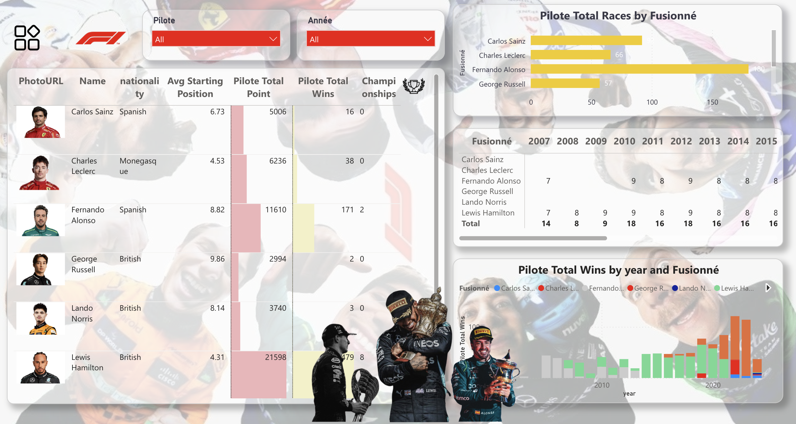

# F1 Fans Dashboard

## Overview

This Power BI project analyzes Formula 1 fans' perspectives collected via Google Forms, enriched with contextual data sourced from Kaggle. The report provides insights into constructors, circuits, drivers, and fan opinions, enabling an interactive exploration of the sport's dynamics.

## Features

- Interactive dashboards across four report pages:
  - **Constructors Analysis**: Performance trends and statistics of F1 constructors.
  - **Circuit Insights**: Historical and geographical information about circuits.
  - **Driver Analysis**: Driver standings, career highlights, and performance metrics.
  - **Fans Opinion**: Survey results reflecting fans' views on drivers, circuits, and the sport overall.
- Slicer filters and buttons for intuitive navigation.
- Info bullets explaining visual elements.

## Data Sources

- **Google Forms Survey**: Custom survey designed to collect F1 fans’ opinions.
- **Kaggle Dataset**: Comprehensive dataset containing constructors, drivers, circuits, and race results.
  - [Formula 1 (1950 - 2023) Dataset on Kaggle](https://www.kaggle.com/datasets/rohanrao/formula-1-world-championship-1950-2020)

## Dashboards 

- **Navigation page**

- **Circuit page**

- **Pilote page**

- **Constructors page**

- **Fans page**

## Contact

For questions or collaboration opportunities, please contact [houdamoudni.01@gmail.com].
